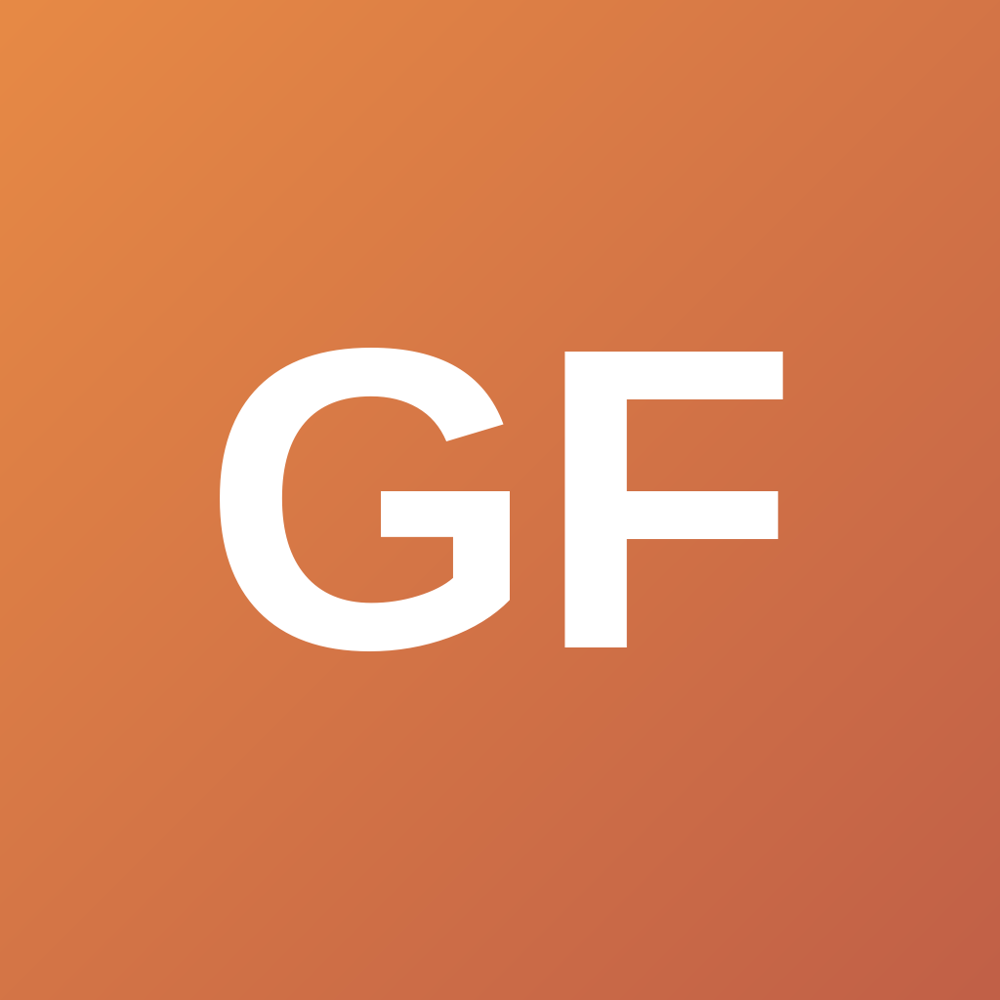
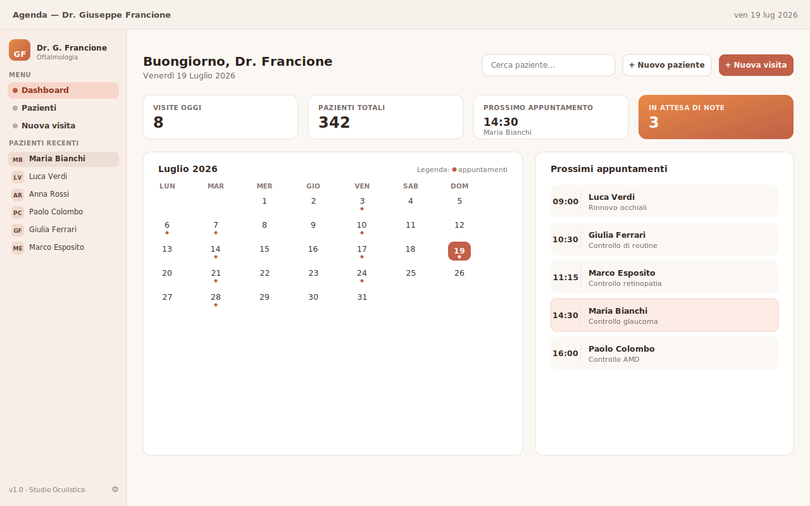
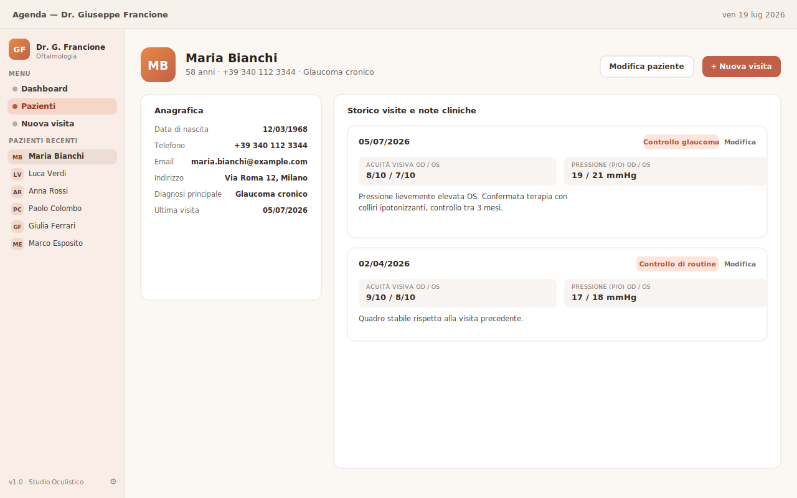
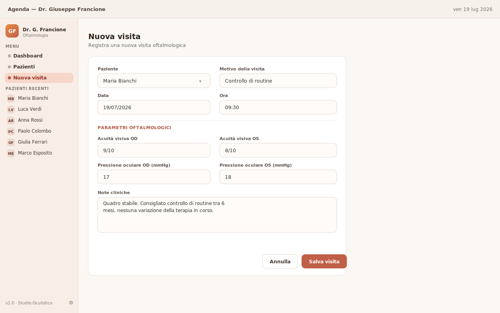

<div align="center">



# DottorTime

**Agenda ambulatoriale desktop per il Dr. Giuseppe Francione**

Anagrafica pazienti · appuntamenti · storico visite e note cliniche — tutto in locale, senza cloud.


</div>

---

## Indice

- [Panoramica](#panoramica)
- [Screenshot](#screenshot)
- [Funzionalità](#funzionalità)
- [Stack tecnologico](#stack-tecnologico)
- [Requisiti](#requisiti)
- [Setup](#setup)
- [Sviluppo](#sviluppo)
- [Controllo tipi](#controllo-tipi)
- [Build di produzione](#build-di-produzione-senza-installer)
- [Creare l'installer](#creare-linstaller)
- [Struttura del progetto](#struttura-del-progetto)
- [Dati, backup e privacy](#dati-backup-e-privacy)
- [Design di riferimento](#design-di-riferimento)
- [Licenza](#licenza)

## Panoramica

DottorTime è un'applicazione desktop pensata per un singolo studio medico (nel caso concreto, uno studio oftalmologico) che deve tenere traccia di pazienti, appuntamenti e visite senza dipendere da servizi esterni o abbonamenti cloud. Tutti i dati — anagrafica, storico clinico, note — restano su un database SQLite locale, sulla macchina del medico.

Punti fermi del progetto:

- **100% locale e offline.** Nessuna telemetria, nessuna chiamata di rete non necessaria, nessun account da creare.
- **Multipiattaforma.** Un'unica base di codice Electron + React, installabile su Windows, macOS e Linux.
- **Portabilità dei dati.** Esportazione/importazione di tutto l'archivio in un singolo file, per backup o migrazione su un altro computer.

Per le decisioni architetturali complete (schema dati, scelte di design, note di implementazione) vedi [`CLAUDE.md`](./CLAUDE.md).

## Screenshot

<table>
<tr>
<td align="center" width="50%">

<br /><sub><b>Dashboard</b> — statistiche del giorno, calendario mensile cliccabile, prossimi appuntamenti</sub>
</td>
<td align="center" width="50%">

<br /><sub><b>Scheda paziente</b> — anagrafica e storico visite con parametri oftalmologici</sub>
</td>
</tr>
<tr>
<td align="center" width="50%" colspan="2">

<br /><sub><b>Nuova visita</b> — registrazione di una visita con parametri oftalmologici e note cliniche</sub>
</td>
</tr>
</table>

## Funzionalità

- **Dashboard** con saluto e data corrente, ricerca paziente, statistiche del giorno (visite oggi, pazienti totali, prossimo appuntamento, note in attesa), calendario mensile con indicatore dei giorni con appuntamenti.
- **Calendario interattivo**: cliccando un giorno qualsiasi del mese, l'elenco sotto mostra gli appuntamenti di quella giornata specifica (passata, presente o futura).
- **Anagrafica pazienti**: creazione, consultazione e modifica di ogni paziente (dati anagrafici, contatti, diagnosi principale).
- **Storico visite**: ogni paziente conserva tutte le visite passate con motivo, acuità visiva OD/OS, pressione intraoculare (PIO) OD/OS e note cliniche libere.
- **Modifica di pazienti e visite** già inseriti, in qualsiasi momento.
- **Ricerca paziente** in tempo reale, che filtra anche la lista "Pazienti recenti" in sidebar.
- **Esportazione e importazione dati** in un unico file (`.dottortime`), con modalità di importazione "unisci" o "sostituisci tutto" — utile per backup periodici o per trasferire l'archivio su un altro computer.
- **Dati medico configurabili** (nome, specializzazione, iniziali mostrate in sidebar) dal pannello Impostazioni.

## Stack tecnologico

| Livello | Scelta |
|---|---|
| Packaging desktop | [Electron](https://www.electronjs.org/) + [electron-vite](https://electron-vite.org/) + [electron-builder](https://www.electron.build/) |
| UI | React 18 + TypeScript, CSS con design token custom (nessun framework CSS) |
| Dati | SQLite locale via [better-sqlite3](https://github.com/WiseLibs/better-sqlite3), accesso esclusivamente dal processo main via IPC |
| Comunicazione | `contextBridge` + `ipcMain.handle`, con `contextIsolation` attiva e `nodeIntegration` disattivata |

Nessun backend remoto, nessuna sincronizzazione cloud.

## Requisiti

- Node.js 18+ (consigliato 20 o 22)
- npm

## Setup

```bash
npm install
```

Il comando `postinstall` (`electron-builder install-app-deps`) ricompila automaticamente `better-sqlite3` per l'ABI di Electron: è normale che richieda qualche minuto la prima volta.

### Risoluzione problemi: `npm install` fallisce su `better-sqlite3` (Windows)

Se `npm install` si interrompe con un errore tipo `gyp ERR! find VS ... You need to install the latest version of Visual Studio`, significa che npm non ha trovato un binario precompilato per la tua versione di Node e sta provando a compilare da sorgente, cosa che richiede i "Build Tools for Visual Studio". Due soluzioni, dalla più semplice:

1. **Usa una versione LTS di Node** (20 o 22) invece dell'ultimissima versione: `better-sqlite3` pubblica binari precompilati per le LTS molto più affidabilmente. Se hai `nvm-windows` installato: `nvm install 22` poi `nvm use 22`, quindi ripeti `npm install` nella cartella del progetto.
2. **Installa i Build Tools**: scarica ["Build Tools for Visual Studio"](https://visualstudio.microsoft.com/visual-cpp-build-tools/) e durante l'installazione seleziona il carico di lavoro "Sviluppo Desktop in C++". Poi ripeti `npm install`.

## Sviluppo

```bash
npm run dev
```

Avvia l'app in modalità sviluppo con hot reload sul renderer.

## Controllo tipi

```bash
npm run typecheck
```

## Build di produzione (senza installer)

```bash
npm run build
```

Compila main, preload e renderer in `out/`.

## Creare l'installer

```bash
npm run dist:win     # .exe (NSIS)
npm run dist:mac     # .dmg
npm run dist:linux   # .AppImage
```

Ogni comando va lanciato sul relativo sistema operativo (electron-builder non fa cross-build affidabile tra piattaforme diverse per gli installer nativi): da Windows puoi generare solo il `.exe`. Gli artefatti finiscono in `dist/`.

### Build automatica per tutti e tre i sistemi operativi (GitHub Actions)

Per ottenere `.exe`, `.dmg` e `.AppImage` senza possedere fisicamente un Mac e un PC Linux, il progetto include un workflow GitHub Actions (`.github/workflows/build.yml`) che compila l'app in parallelo su macchine Windows/macOS/Linux gestite da GitHub.

**Per lanciare una build:**

- **Manualmente**: tab Actions → workflow "Build installers" → pulsante "Run workflow".
- **Con un tag di versione** (consigliato quando l'app è pronta per una nuova release):
  ```bash
  git tag v1.0.0
  git push origin v1.0.0
  ```

Dopo qualche minuto, apri la run completata e in fondo alla pagina trovi la sezione **Artifacts** con tre pacchetti scaricabili (`dottortime-windows`, `dottortime-macos`, `dottortime-linux`), ciascuno contenente l'installer per quel sistema.

**Nota su Gatekeeper/SmartScreen**: questi installer non sono firmati con un certificato di sviluppatore (Apple/Microsoft richiedono un abbonamento a pagamento per questo). È normale che Windows mostri un avviso "Windows ha protetto il tuo PC" (si procede da "Ulteriori informazioni" → "Esegui comunque") e che macOS blocchi l'app al primo avvio (tasto destro sull'app → "Apri", oppure Impostazioni di Sistema → Privacy e Sicurezza → "Apri comunque"). Se in futuro l'app verrà distribuita a più persone vale la pena valutare la firma del codice.

## Struttura del progetto

```
DottorTime/
  Design/                      # mockup di riferimento (Claude Design)
  docs/screenshots/           # immagini usate in questo README
  src/
    main/                     # processo main Electron: finestra, DB, IPC
      db/                     # schema SQLite + query (pazienti, visite, impostazioni)
      ipc/                    # registrazione handler IPC
    preload/                  # contextBridge API esposta al renderer
    renderer/
      src/
        components/           # componenti UI riutilizzabili
        screens/               # Dashboard, PatientDetail, NewVisit
        styles/                # design token e CSS
        lib/                   # utility (formattazione date, ecc.)
    shared/                   # tipi e contratti IPC condivisi main/preload/renderer
  electron-builder.yml
  electron.vite.config.ts
  CLAUDE.md                   # guida di riferimento per lo sviluppo
```

## Dati, backup e privacy

Il database (`dottortime.db`) vive nella cartella dati utente del sistema operativo — non nella cartella di installazione — quindi sopravvive agli aggiornamenti dell'app.

Dal pannello **Impostazioni** (icona ⚙ in fondo alla sidebar) è possibile:

- Modificare i dati del medico (nome, specializzazione, iniziali).
- **Esportare** tutti i pazienti, le visite e le note cliniche in un unico file `.dottortime`.
- **Importare** un file esportato in precedenza, scegliendo tra unione (`merge`) o sostituzione completa (`replace`) dei dati esistenti.

Trattandosi di dati sanitari (categoria particolare ai sensi del GDPR), l'app non effettua alcuna telemetria né chiamata di rete non necessaria: tutto resta sul computer del medico. Il file di export attualmente **non è cifrato** (JSON in chiaro) — vedi `CLAUDE.md` per le considerazioni su un'eventuale cifratura futura.

## Design di riferimento

Il design dell'interfaccia è stato realizzato con Claude Design e si trova in `Design/agenda-visite-medico/`. L'implementazione ne segue fedelmente palette, tipografia e layout (vedi `CLAUDE.md` per i dettagli dei design token).

## Licenza

Distribuito con licenza [MIT](./LICENSE).
